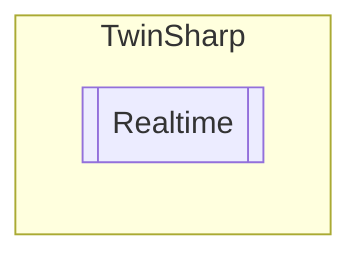

# Realtime `Public class`

## Diagram


## Members
### Properties
#### Public  properties
| Type | Name | Methods |
| --- | --- | --- |
| `uint` | [`CpuUsage`](#cpuusage)<br>Gets the current CPU usage of a TwinCAT system. Corresponds to the function block TC_CpuUsage. This function corresponds to the display of CPU usage in the TwinCAT system menu under the real-time settings. | `get` |

### Methods
#### Public  methods
| Returns | Name |
| --- | --- |
| [`RTimeCpuSettings`](./RTimeCpuSettings.md) | [`ReadCpuSettings`](#readcpusettings)()<br>Reads the CPU settings of the TwinCAT system. |
| [`RTimeCpuLatency`](./RTimeCpuLatency.md) | [`ReadLatency`](#readlatency)() |
| `AdsErrorCode` | [`SetSharedCores`](#setsharedcores)(`uint` sharedCores)<br>Sets the shared cores configuration for the TwinCAT system. |

## Details
### Constructors
#### Realtime
[*Source code*](https://github.com///blob//TwinSharp/Realtime.cs#L9)
```csharp
internal Realtime(AmsNetId target)
```
##### Arguments
| Type | Name | Description |
| --- | --- | --- |
| `AmsNetId` | target |   |

### Methods
#### SetSharedCores
[*Source code*](https://github.com///blob//TwinSharp/Realtime.cs#L22)
```csharp
public AdsErrorCode SetSharedCores(uint sharedCores)
```
##### Arguments
| Type | Name | Description |
| --- | --- | --- |
| `uint` | sharedCores |  |

##### Summary
Sets the shared cores configuration for the TwinCAT system.

##### Returns


#### ReadCpuSettings
[*Source code*](https://github.com///blob//TwinSharp/Realtime.cs#L62)
```csharp
public RTimeCpuSettings ReadCpuSettings()
```
##### Summary
Reads the CPU settings of the TwinCAT system.

##### Returns


#### ReadLatency
[*Source code*](https://github.com///blob//TwinSharp/Realtime.cs#L89)
```csharp
public RTimeCpuLatency ReadLatency()
```

### Properties
#### CpuUsage
```csharp
public uint CpuUsage { get; }
```
##### Summary
Gets the current CPU usage of a TwinCAT system. Corresponds to the function block TC_CpuUsage. This function corresponds to the display of CPU usage in the TwinCAT system menu under the real-time settings.

*Generated with* [*ModularDoc*](https://github.com/hailstorm75/ModularDoc)
