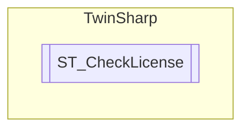

# ST_CheckLicense `Public class`

## Diagram


## Members
### Methods
#### Public  methods
| Returns | Name |
| --- | --- |
| `string` | [`ToString`](#tostring)() |

## Details
### Constructors
#### ST_CheckLicense
[*Source code*](https://github.com///blob//TwinSharp/Structs.cs#L35)
```csharp
public ST_CheckLicense(byte[] bytes, string descriptionText)
```
##### Arguments
| Type | Name | Description |
| --- | --- | --- |
| `byte``[]` | bytes |   |
| `string` | descriptionText |   |

### Methods
#### ToString
[*Source code*](https://github.com///blob//TwinSharp/Structs.cs#L63)
```csharp
public override string ToString()
```

*Generated with* [*ModularDoc*](https://github.com/hailstorm75/ModularDoc)
