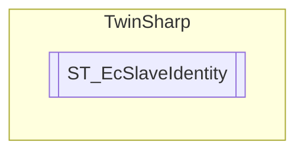

# ST_EcSlaveIdentity `Public class`

## Diagram


## Details
### Constructors
#### ST_EcSlaveIdentity
[*Source code*](https://github.com///blob//TwinSharp/Structs.cs#L91)
```csharp
public ST_EcSlaveIdentity(byte[] bytes)
```
##### Arguments
| Type | Name | Description |
| --- | --- | --- |
| `byte``[]` | bytes |   |

*Generated with* [*ModularDoc*](https://github.com/hailstorm75/ModularDoc)
