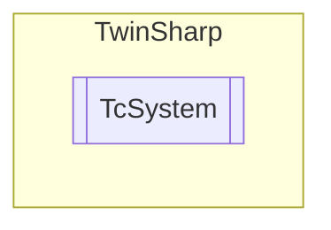

# TcSystem `Public class`

## Diagram


## Members
### Methods
#### Public  methods
| Returns | Name |
| --- | --- |
| [`EtherCatMaster`](./EtherCatMaster.md)`[]` | [`ListEtherCatMasters`](#listethercatmasters)() |
| `void` | [`Restart`](#restart)()<br>Can be used to restart the TwinCAT system. <br>            Corresponds to the Restart command on the TwinCAT system menu (on the right of the Windows taskbar). Restarting the TwinCAT system involves the TwinCAT system first being stopped, and then immediately started again |
| `void` | [`Stop`](#stop)()<br>Can be used to stop the TwinCAT system. The function corresponds to the Stop command on the TwinCAT system menu (on the right of the Windows taskbar). |
| `void` | [`SwitchToConfigMode`](#switchtoconfigmode)()<br>A TwinCAT system in RUN mode (green TwinCAT system icon) can be switched to CONFIG mode (blue TwinCAT system icon) via the function block "TC_Config".<br>            If the system is already in CONFIG mode, it is first switched to STOP mode (red TwinCAT system icon) and then to CONFIG mode. |

#### Public Static methods
| Returns | Name |
| --- | --- |
| [`AmsRoute`](./AmsRoute.md)`[]` | [`ListLocalStaticRoutes`](#listlocalstaticroutes)() |

## Details
### Constructors
#### TcSystem [1/2]
[*Source code*](https://github.com///blob//TwinSharp/TcSystem.cs#L19)
```csharp
public TcSystem()
```
##### Summary
Create a representation of a TwinCAT system on the local machine.

#### TcSystem [2/2]
[*Source code*](https://github.com///blob//TwinSharp/TcSystem.cs#L29)
```csharp
public TcSystem(AmsNetId target)
```
##### Arguments
| Type | Name | Description |
| --- | --- | --- |
| `AmsNetId` | target |  |

##### Summary
Create a representation of a TwinCAT system on a remote target machine.

### Methods
#### SwitchToConfigMode
[*Source code*](https://github.com///blob//TwinSharp/TcSystem.cs#L49)
```csharp
public void SwitchToConfigMode()
```
##### Summary
A TwinCAT system in RUN mode (green TwinCAT system icon) can be switched to CONFIG mode (blue TwinCAT system icon) via the function block "TC_Config".
            If the system is already in CONFIG mode, it is first switched to STOP mode (red TwinCAT system icon) and then to CONFIG mode.

#### Restart
[*Source code*](https://github.com///blob//TwinSharp/TcSystem.cs#L64)
```csharp
public void Restart()
```
##### Summary
Can be used to restart the TwinCAT system. 
            Corresponds to the Restart command on the TwinCAT system menu (on the right of the Windows taskbar). Restarting the TwinCAT system involves the TwinCAT system first being stopped, and then immediately started again

#### Stop
[*Source code*](https://github.com///blob//TwinSharp/TcSystem.cs#L78)
```csharp
public void Stop()
```
##### Summary
Can be used to stop the TwinCAT system. The function corresponds to the Stop command on the TwinCAT system menu (on the right of the Windows taskbar).

#### ListEtherCatMasters
[*Source code*](https://github.com///blob//TwinSharp/TcSystem.cs#L89)
```csharp
public EtherCatMaster ListEtherCatMasters()
```

#### ListLocalStaticRoutes
[*Source code*](https://github.com///blob//TwinSharp/TcSystem.cs#L172)
```csharp
public static AmsRoute ListLocalStaticRoutes()
```

*Generated with* [*ModularDoc*](https://github.com/hailstorm75/ModularDoc)
