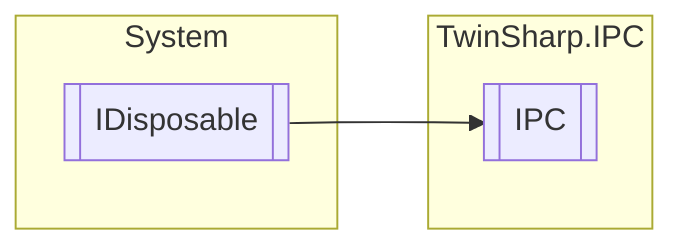

# IPC `Public class`

## Diagram


## Members
### Methods
#### Public  methods
| Returns | Name |
| --- | --- |
| `void` | [`Dispose`](#dispose)() |

## Details
### Inheritance
 - `IDisposable`

### Constructors
#### IPC [1/2]
[*Source code*](https://github.com///blob//TwinSharp/IPC/IPC.cs#L25)
```csharp
public IPC()
```
##### Summary
Represents a localhost Beckhoff IPC.

#### IPC [2/2]
[*Source code*](https://github.com///blob//TwinSharp/IPC/IPC.cs#L35)
```csharp
public IPC(AmsNetId target)
```
##### Arguments
| Type | Name | Description |
| --- | --- | --- |
| `AmsNetId` | target |  |

##### Summary
Represents a Beckhoff IPC on a remote target.

### Methods
#### Dispose
[*Source code*](https://github.com///blob//TwinSharp/IPC/IPC.cs#L129)
```csharp
public virtual void Dispose()
```

*Generated with* [*ModularDoc*](https://github.com/hailstorm75/ModularDoc)
