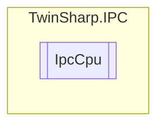

# IpcCpu `Public class`

## Diagram


## Members
### Properties
#### Public  properties
| Type | Name | Methods |
| --- | --- | --- |
| `uint` | [`Frequency`](#frequency) | `get` |
| `short` | [`TemperatureCelsius`](#temperaturecelsius)<br>Requires BIOS API | `get` |
| `ushort` | [`UsagePercent`](#usagepercent) | `get` |

## Details
### Constructors
#### IpcCpu
[*Source code*](https://github.com///blob//TwinSharp/IPC/IpcCpu.cs#L12)
```csharp
internal IpcCpu(AdsClient client, ushort mdpId)
```
##### Arguments
| Type | Name | Description |
| --- | --- | --- |
| `AdsClient` | client |   |
| `ushort` | mdpId |   |

### Properties
#### Frequency
```csharp
public uint Frequency { get; }
```

#### UsagePercent
```csharp
public ushort UsagePercent { get; }
```

#### TemperatureCelsius
```csharp
public short TemperatureCelsius { get; }
```
##### Summary
Requires BIOS API

*Generated with* [*ModularDoc*](https://github.com/hailstorm75/ModularDoc)
