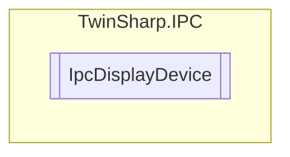

# IpcDisplayDevice `Public class`

## Diagram


## Members
### Properties
#### Public  properties
| Type | Name | Methods |
| --- | --- | --- |
| `byte` | [`ActiveDisplayModeID`](#activedisplaymodeid) | `get, set` |
| `uint` | [`Brightness`](#brightness)<br>Valid values: 20-100 (20 lowest brightness, 100 maximum brightness) | `get, set` |
| `string` | [`ComPort`](#comport)<br>Windows Embedded Standard (WES): e.g. "Com4"<br>            Windows CE: under Windows CE, the Com Port must end with a colon, e.g. "COM4:" | `get, set` |
| `string` | [`DisplayModeDescription`](#displaymodedescription) | `get` |
| `bool` | [`IsPrimaryDisplay`](#isprimarydisplay) | `get` |
| `bool` | [`LightEnabled`](#lightenabled)<br>Valid values: TRUE = background light ON, FALSE = background light OFF | `get, set` |
| `uint` | [`Version`](#version) | `get` |

### Methods
#### Public  methods
| Returns | Name |
| --- | --- |
| `void` | [`SaveBrightnessPersistent`](#savebrightnesspersistent)() |

## Details
### Constructors
#### IpcDisplayDevice
[*Source code*](https://github.com///blob//TwinSharp/IPC/IpcDisplayDevice.cs#L16)
```csharp
internal IpcDisplayDevice(AdsClient client, ushort mdpId)
```
##### Arguments
| Type | Name | Description |
| --- | --- | --- |
| `AdsClient` | client |   |
| `ushort` | mdpId |   |

### Methods
#### SaveBrightnessPersistent
[*Source code*](https://github.com///blob//TwinSharp/IPC/IpcDisplayDevice.cs#L91)
```csharp
public void SaveBrightnessPersistent()
```

### Properties
#### ActiveDisplayModeID
```csharp
public byte ActiveDisplayModeID { get; set; }
```

#### DisplayModeDescription
```csharp
public string DisplayModeDescription { get; }
```

#### IsPrimaryDisplay
```csharp
public bool IsPrimaryDisplay { get; }
```

#### ComPort
```csharp
public string ComPort { get; set; }
```
##### Summary
Windows Embedded Standard (WES): e.g. "Com4"
            Windows CE: under Windows CE, the Com Port must end with a colon, e.g. "COM4:"

#### Version
```csharp
public uint Version { get; }
```

#### Brightness
```csharp
public uint Brightness { get; set; }
```
##### Summary
Valid values: 20-100 (20 lowest brightness, 100 maximum brightness)

#### LightEnabled
```csharp
public bool LightEnabled { get; set; }
```
##### Summary
Valid values: TRUE = background light ON, FALSE = background light OFF

*Generated with* [*ModularDoc*](https://github.com/hailstorm75/ModularDoc)
