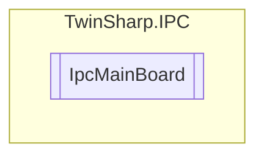

# IpcMainBoard `Public class`

## Description
This module provides mainboard information, such as type, serial number, production date, boot count, operating time, and temperature.
            This module is not supported by all devices, since it requires a special BIOS.

## Diagram


## Members
### Properties
#### Public  properties
| Type | Name | Methods |
| --- | --- | --- |
| `byte` | [`BiosMajorVersion`](#biosmajorversion) | `get` |
| `byte` | [`BiosMinorVersion`](#biosminorversion) | `get` |
| `string` | [`BiosVersion`](#biosversion) | `get` |
| `uint` | [`BootCount`](#bootcount) | `get` |
| `byte` | [`MainBoardRevision`](#mainboardrevision) | `get` |
| `int` | [`MaxBoardTemperatureCelsius`](#maxboardtemperaturecelsius)<br>Highest measured temperature. | `get` |
| `int` | [`MaxInputMilliVolts`](#maxinputmillivolts)<br>Highest measured voltage. | `get` |
| `int` | [`MinBoardTemperatureCelsius`](#minboardtemperaturecelsius)<br>Lowest measured temperature. | `get` |
| `int` | [`MinInputMilliVolts`](#mininputmillivolts)<br>Lowest measured voltage. | `get` |
| `uint` | [`OperatingTimeMinutes`](#operatingtimeminutes) | `get` |
| `string` | [`ProductionDate`](#productiondate) | `get` |
| `string` | [`SerialNumber`](#serialnumber) | `get` |
| `short` | [`TemperatureCelsius`](#temperaturecelsius) | `get` |
| `string` | [`Type`](#type) | `get` |

## Details
### Summary
This module provides mainboard information, such as type, serial number, production date, boot count, operating time, and temperature.
            This module is not supported by all devices, since it requires a special BIOS.

### Constructors
#### IpcMainBoard
[*Source code*](https://github.com///blob//TwinSharp/IPC/IpcMainBoard.cs#L22)
```csharp
internal IpcMainBoard(AdsClient client, ushort mdpId)
```
##### Arguments
| Type | Name | Description |
| --- | --- | --- |
| `AdsClient` | client |   |
| `ushort` | mdpId |   |

### Properties
#### Type
```csharp
public string Type { get; }
```

#### SerialNumber
```csharp
public string SerialNumber { get; }
```

#### ProductionDate
```csharp
public string ProductionDate { get; }
```

#### BootCount
```csharp
public uint BootCount { get; }
```

#### OperatingTimeMinutes
```csharp
public uint OperatingTimeMinutes { get; }
```

#### MinBoardTemperatureCelsius
```csharp
public int MinBoardTemperatureCelsius { get; }
```
##### Summary
Lowest measured temperature.

#### MaxBoardTemperatureCelsius
```csharp
public int MaxBoardTemperatureCelsius { get; }
```
##### Summary
Highest measured temperature.

#### MinInputMilliVolts
```csharp
public int MinInputMilliVolts { get; }
```
##### Summary
Lowest measured voltage.

#### MaxInputMilliVolts
```csharp
public int MaxInputMilliVolts { get; }
```
##### Summary
Highest measured voltage.

#### TemperatureCelsius
```csharp
public short TemperatureCelsius { get; }
```

#### MainBoardRevision
```csharp
public byte MainBoardRevision { get; }
```

#### BiosMajorVersion
```csharp
public byte BiosMajorVersion { get; }
```

#### BiosMinorVersion
```csharp
public byte BiosMinorVersion { get; }
```

#### BiosVersion
```csharp
public string BiosVersion { get; }
```

*Generated with* [*ModularDoc*](https://github.com/hailstorm75/ModularDoc)
