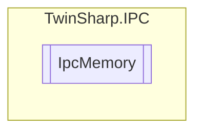

# IpcMemory `Public class`

## Diagram


## Members
### Properties
#### Public  properties
| Type | Name | Methods |
| --- | --- | --- |
| `uint` | [`MemoryDivision`](#memorydivision)<br>Memory division.<br>            Only for WindowsCE. | `get` |
| `ulong` | [`ProgramMemoryAllocated`](#programmemoryallocated) | `get` |
| `ulong` | [`ProgramMemoryAvailable`](#programmemoryavailable) | `get` |
| `uint` | [`StorageMemoryAllocated`](#storagememoryallocated)<br>Storage Memory Allocated.<br>            Only for WindowsCE. | `get` |
| `uint` | [`StorageMemoryAvailable`](#storagememoryavailable)<br>Storage Memory Available.<br>            Only for WindowsCE. | `get` |

## Details
### Constructors
#### IpcMemory
[*Source code*](https://github.com///blob//TwinSharp/IPC/IpcMemory.cs#L12)
```csharp
internal IpcMemory(AdsClient client, ushort mdpId)
```
##### Arguments
| Type | Name | Description |
| --- | --- | --- |
| `AdsClient` | client |   |
| `ushort` | mdpId |   |

### Properties
#### ProgramMemoryAllocated
```csharp
public ulong ProgramMemoryAllocated { get; }
```

#### ProgramMemoryAvailable
```csharp
public ulong ProgramMemoryAvailable { get; }
```

#### StorageMemoryAllocated
```csharp
public uint StorageMemoryAllocated { get; }
```
##### Summary
Storage Memory Allocated.
            Only for WindowsCE.

#### StorageMemoryAvailable
```csharp
public uint StorageMemoryAvailable { get; }
```
##### Summary
Storage Memory Available.
            Only for WindowsCE.

#### MemoryDivision
```csharp
public uint MemoryDivision { get; }
```
##### Summary
Memory division.
            Only for WindowsCE.

*Generated with* [*ModularDoc*](https://github.com/hailstorm75/ModularDoc)
