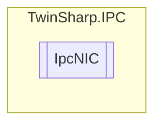

# IpcNIC `Public class`

## Diagram


## Members
### Properties
#### Public  properties
| Type | Name | Methods |
| --- | --- | --- |
| `bool` | [`DHCP`](#dhcp) | `get, set` |
| `string` | [`IPv4Address`](#ipv4address)<br>With WinCE a reboot may be required in order to obtain a correct value. Without a reboot WinCE may still supply the previous value! | `get, set` |
| `string` | [`IPv4DNSServers`](#ipv4dnsservers)<br>Not for WinCE. | `get, set` |
| `string` | [`IPv4DNSServersActive`](#ipv4dnsserversactive)<br>Only for TC/BSD and TC/RTOS | `get` |
| `string` | [`IPv4DefaultGateway`](#ipv4defaultgateway)<br>With WinCE a reboot may be required in order to obtain a correct value. Without a reboot WinCE may still supply the previous value!<br>            WinCE: depending on the DHCP status, a "Read" operation has the return value "DefaultGateway" or "DhcpDefaultGateway". | `get, set` |
| `string` | [`IPv4SubNetMask`](#ipv4subnetmask)<br>With WinCE a reboot may be required in order to obtain a correct value. Without a reboot WinCE may still supply the previous value! | `get, set` |
| `string` | [`MACAddress`](#macaddress) | `get` |
| `string` | [`VirtualDeviceName`](#virtualdevicename)<br>Only for Windows. | `get, set` |

## Details
### Constructors
#### IpcNIC
[*Source code*](https://github.com///blob//TwinSharp/IPC/IpcNIC.cs#L12)
```csharp
internal IpcNIC(AdsClient client, ushort mdpId)
```
##### Arguments
| Type | Name | Description |
| --- | --- | --- |
| `AdsClient` | client |   |
| `ushort` | mdpId |   |

### Properties
#### MACAddress
```csharp
public string MACAddress { get; }
```

#### IPv4Address
```csharp
public string IPv4Address { get; set; }
```
##### Summary
With WinCE a reboot may be required in order to obtain a correct value. Without a reboot WinCE may still supply the previous value!

#### IPv4SubNetMask
```csharp
public string IPv4SubNetMask { get; set; }
```
##### Summary
With WinCE a reboot may be required in order to obtain a correct value. Without a reboot WinCE may still supply the previous value!

#### DHCP
```csharp
public bool DHCP { get; set; }
```

#### IPv4DefaultGateway
```csharp
public string IPv4DefaultGateway { get; set; }
```
##### Summary
With WinCE a reboot may be required in order to obtain a correct value. Without a reboot WinCE may still supply the previous value!
            WinCE: depending on the DHCP status, a "Read" operation has the return value "DefaultGateway" or "DhcpDefaultGateway".

#### IPv4DNSServers
```csharp
public string IPv4DNSServers { get; set; }
```
##### Summary
Not for WinCE.

#### VirtualDeviceName
```csharp
public string VirtualDeviceName { get; set; }
```
##### Summary
Only for Windows.

#### IPv4DNSServersActive
```csharp
public string IPv4DNSServersActive { get; }
```
##### Summary
Only for TC/BSD and TC/RTOS

*Generated with* [*ModularDoc*](https://github.com/hailstorm75/ModularDoc)
