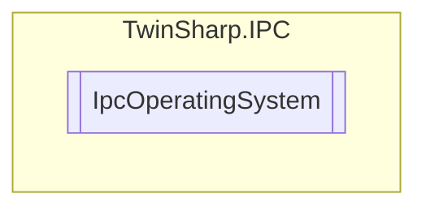

# IpcOperatingSystem `Public class`

## Diagram


## Members
### Properties
#### Public  properties
| Type | Name | Methods |
| --- | --- | --- |
| `uint` | [`BuildNumber`](#buildnumber) | `get` |
| `string` | [`CSDVersion`](#csdversion) | `get` |
| `uint` | [`MajorVersion`](#majorversion) | `get` |
| `uint` | [`MinorVersion`](#minorversion) | `get` |
| `ulong` | [`UpTimeSeconds`](#uptimeseconds) | `get` |

## Details
### Constructors
#### IpcOperatingSystem
[*Source code*](https://github.com///blob//TwinSharp/IPC/IpcOperatingSystem.cs#L13)
```csharp
internal IpcOperatingSystem(AdsClient client, ushort mdpId)
```
##### Arguments
| Type | Name | Description |
| --- | --- | --- |
| `AdsClient` | client |   |
| `ushort` | mdpId |   |

### Properties
#### MajorVersion
```csharp
public uint MajorVersion { get; }
```

#### MinorVersion
```csharp
public uint MinorVersion { get; }
```

#### BuildNumber
```csharp
public uint BuildNumber { get; }
```

#### CSDVersion
```csharp
public string CSDVersion { get; }
```

#### UpTimeSeconds
```csharp
public ulong UpTimeSeconds { get; }
```

*Generated with* [*ModularDoc*](https://github.com/hailstorm75/ModularDoc)
