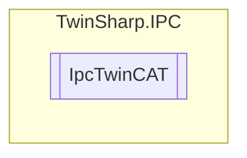

# IpcTwinCAT `Public class`

## Diagram


## Members
### Properties
#### Public  properties
| Type | Name | Methods |
| --- | --- | --- |
| `string` | [`AmsNetID`](#amsnetid) | `get` |
| `ushort` | [`BuildNumber`](#buildnumber) | `get` |
| `ushort` | [`Length`](#length) | `get` |
| `string` | [`LogFilePath`](#logfilepath)<br>Only for WindowsCE | `get` |
| `uint` | [`LogFileSize`](#logfilesize)<br>Only for WindowsCE | `get` |
| `ushort` | [`MajorVersion`](#majorversion) | `get` |
| `ushort` | [`MinorVersion`](#minorversion) | `get` |
| `uint` | [`RegLevel`](#reglevel)<br>Only for TwinCAT 2. | `get` |
| `ushort` | [`Revision`](#revision) | `get` |
| `ushort` | [`RunAsDevice`](#runasdevice)<br>Only for WindowsCE | `get` |
| `ulong` | [`SecondsSinceLastStatusChange`](#secondssincelaststatuschange) | `get` |
| `ushort` | [`ShowTargetVisu`](#showtargetvisu)<br>Only for WindowsCE | `get` |
| `ushort` | [`Status`](#status) | `get` |
| `string` | [`SystemID`](#systemid) | `get` |

## Details
### Constructors
#### IpcTwinCAT
[*Source code*](https://github.com///blob//TwinSharp/IPC/IpcTwinCAT.cs#L13)
```csharp
internal IpcTwinCAT(AdsClient client, ushort mdpId)
```
##### Arguments
| Type | Name | Description |
| --- | --- | --- |
| `AdsClient` | client |   |
| `ushort` | mdpId |   |

### Properties
#### Length
```csharp
public ushort Length { get; }
```

#### MajorVersion
```csharp
public ushort MajorVersion { get; }
```

#### MinorVersion
```csharp
public ushort MinorVersion { get; }
```

#### BuildNumber
```csharp
public ushort BuildNumber { get; }
```

#### AmsNetID
```csharp
public string AmsNetID { get; }
```

#### RegLevel
```csharp
public uint RegLevel { get; }
```
##### Summary
Only for TwinCAT 2.

#### Status
```csharp
public ushort Status { get; }
```

#### RunAsDevice
```csharp
public ushort RunAsDevice { get; }
```
##### Summary
Only for WindowsCE

#### ShowTargetVisu
```csharp
public ushort ShowTargetVisu { get; }
```
##### Summary
Only for WindowsCE

#### LogFileSize
```csharp
public uint LogFileSize { get; }
```
##### Summary
Only for WindowsCE

#### LogFilePath
```csharp
public string LogFilePath { get; }
```
##### Summary
Only for WindowsCE

#### SystemID
```csharp
public string SystemID { get; }
```

#### Revision
```csharp
public ushort Revision { get; }
```

#### SecondsSinceLastStatusChange
```csharp
public ulong SecondsSinceLastStatusChange { get; }
```

*Generated with* [*ModularDoc*](https://github.com/hailstorm75/ModularDoc)
