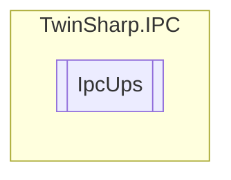

# IpcUps `Public class`

## Diagram


## Members
### Properties
#### Public  properties
| Type | Name | Methods |
| --- | --- | --- |
| `byte` | [`BatteryCapacityPercent`](#batterycapacitypercent) | `get` |
| `string` | [`BatteryReplaceDate`](#batteryreplacedate) | `get` |
| `uint` | [`BatteryRuntimeSeconds`](#batteryruntimeseconds) | `get` |
| `byte` | [`BatteryStatus`](#batterystatus) | `get` |
| `ushort` | [`Build`](#build) | `get` |
| `byte` | [`CommunicationStatus`](#communicationstatus) | `get` |
| `bool` | [`FanError`](#fanerror) | `get` |
| `bool` | [`IntervalServiceStatus`](#intervalservicestatus) | `get` |
| `bool` | [`NoBattery`](#nobattery) | `get` |
| `bool` | [`PersistentPowerFailCount`](#persistentpowerfailcount) | `get` |
| `uint` | [`PowerFailCounter`](#powerfailcounter) | `get` |
| `byte` | [`PowerStatus`](#powerstatus) | `get` |
| `byte` | [`Revision`](#revision) | `get` |
| `string` | [`SerialNumber`](#serialnumber) | `get` |
| `string` | [`UPSModel`](#upsmodel) | `get` |
| `string` | [`VendorName`](#vendorname) | `get` |
| `byte` | [`Version`](#version) | `get` |

## Details
### Constructors
#### IpcUps
[*Source code*](https://github.com///blob//TwinSharp/IPC/IpcUps.cs#L12)
```csharp
internal IpcUps(AdsClient client, ushort mdpId)
```
##### Arguments
| Type | Name | Description |
| --- | --- | --- |
| `AdsClient` | client |   |
| `ushort` | mdpId |   |

### Properties
#### UPSModel
```csharp
public string UPSModel { get; }
```

#### VendorName
```csharp
public string VendorName { get; }
```

#### Version
```csharp
public byte Version { get; }
```

#### Revision
```csharp
public byte Revision { get; }
```

#### Build
```csharp
public ushort Build { get; }
```

#### SerialNumber
```csharp
public string SerialNumber { get; }
```

#### PowerStatus
```csharp
public byte PowerStatus { get; }
```

#### CommunicationStatus
```csharp
public byte CommunicationStatus { get; }
```

#### BatteryStatus
```csharp
public byte BatteryStatus { get; }
```

#### BatteryCapacityPercent
```csharp
public byte BatteryCapacityPercent { get; }
```

#### BatteryRuntimeSeconds
```csharp
public uint BatteryRuntimeSeconds { get; }
```

#### PersistentPowerFailCount
```csharp
public bool PersistentPowerFailCount { get; }
```

#### PowerFailCounter
```csharp
public uint PowerFailCounter { get; }
```

#### FanError
```csharp
public bool FanError { get; }
```

#### NoBattery
```csharp
public bool NoBattery { get; }
```

#### BatteryReplaceDate
```csharp
public string BatteryReplaceDate { get; }
```

#### IntervalServiceStatus
```csharp
public bool IntervalServiceStatus { get; }
```

*Generated with* [*ModularDoc*](https://github.com/hailstorm75/ModularDoc)
