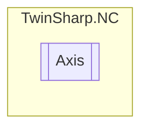

# Axis `Public class`

## Diagram


## Members
### Methods
#### Public  methods
| Returns | Name |
| --- | --- |
| `string` | [`ToString`](#tostring)() |

## Details
### Constructors
#### Axis
[*Source code*](https://github.com///blob//TwinSharp/NC/Axis.cs#L15)
```csharp
public Axis(AdsClient client, uint id)
```
##### Arguments
| Type | Name | Description |
| --- | --- | --- |
| `AdsClient` | client |   |
| `uint` | id |   |

### Methods
#### ToString
[*Source code*](https://github.com///blob//TwinSharp/NC/Axis.cs#L48)
```csharp
public override string ToString()
```

*Generated with* [*ModularDoc*](https://github.com/hailstorm75/ModularDoc)
