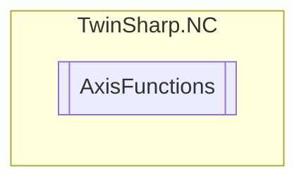

# AxisFunctions `Public class`

## Diagram


## Members
### Methods
#### Public  methods
| Returns | Name |
| --- | --- |
| `void` | [`ActivateCompleteAxis`](#activatecompleteaxis)() |
| `void` | [`ActivateDriveOutput`](#activatedriveoutput)() |
| `void` | [`ChangeDriveOutput`](#changedriveoutput)([`DriveOutputStartType`](./DriveOutputStartType.md) startType, `double` newValue) |
| `void` | [`ClearAxisTask`](#clearaxistask)() |
| `void` | [`DeactivateCompleteAxis`](#deactivatecompleteaxis)() |
| `void` | [`DeactivateDriveOutput`](#deactivatedriveoutput)() |
| `void` | [`EmergencyStopWithControlledRamp`](#emergencystopwithcontrolledramp)(`double` deceleration, `double` jerk) |
| `void` | [`ExtendedAxisStart`](#extendedaxisstart)([`GroupAxisStartType`](./GroupAxisStartType.md) startType, `double` targetPosition, `double` requireVelocity, `double` acceleration, `double` deceleration, `double` jerk)<br>Extended axis start. |
| `void` | [`NewEndPositionAxis`](#newendpositionaxis)([`EndPositionType`](./EndPositionType.md) endPositionType, `double` newEndPosition) |
| `void` | [`OrientedStop`](#orientedstop)(`double` moduloEndPosition, `double` deceleration, `double` jerk) |
| `void` | [`ReferenceAxis`](#referenceaxis)() |
| `void` | [`ReleaseParkingBrake`](#releaseparkingbrake)(`ushort` release) |
| `void` | [`Reset`](#reset)() |
| `void` | [`SetActualAxisPosition`](#setactualaxisposition)([`ActualPositionType`](./ActualPositionType.md) actualPositionType, `double` actualPosition) |
| `void` | [`SetActualPositionOnTheFly`](#setactualpositiononthefly)([`ActualPositionType`](./ActualPositionType.md) positionType, `int` controlword, `double` newActualPosition) |
| `void` | [`SetExternalAxisError`](#setexternalaxiserror)(`uint` errorCode) |
| `void` | [`StandardAxisStart`](#standardaxisstart)([`GroupAxisStartType`](./GroupAxisStartType.md) startType, `double` endPosition, `double` velocity) |
| `void` | [`StartDriveOutput`](#startdriveoutput)([`DriveOutputStartType`](./DriveOutputStartType.md) startType, `double` value) |
| `void` | [`StartReversingOperation`](#startreversingoperation)([`GroupAxisStartType`](./GroupAxisStartType.md) startType, `double` targePosition1, `double` targetPosition2, `double` velocity, `double` idleSeconds) |
| `void` | [`StartReversingOperationVelocityJumps`](#startreversingoperationvelocityjumps)([`GroupAxisStartType`](./GroupAxisStartType.md) startType, `double` velocity1, `double` velocity2, `double` travelSeconds, `double` idleSeconds, `uint` repetitionCount)<br>Start reversing operation with velocity jumps (SERVO):<br>            (can be used to determine the velocity step response) |
| `void` | [`StartSinusOscillationSequence`](#startsinusoscillationsequence)(`double` baseAmplitude, `double` baseFrequency, `double` startAmplitude, `double` feedConstantMotor, `double` startFrequency, `double` stopFrequency, `double` stepDurationSeconds, `uint` stepCycles) |
| `void` | [`Stop`](#stop)() |
| `void` | [`StopDriveOutput`](#stopdriveoutput)() |
| `void` | [`StopWithControlledRamp`](#stopwithcontrolledramp)(`double` deceleration, `double` jerk) |

## Details
### Constructors
#### AxisFunctions
[*Source code*](https://github.com///blob//TwinSharp/NC/AxisFunctions.cs#L9)
```csharp
internal AxisFunctions(AdsClient client, uint id)
```
##### Arguments
| Type | Name | Description |
| --- | --- | --- |
| `AdsClient` | client |   |
| `uint` | id |   |

### Methods
#### Reset
[*Source code*](https://github.com///blob//TwinSharp/NC/AxisFunctions.cs#L16)
```csharp
public void Reset()
```

#### Stop
[*Source code*](https://github.com///blob//TwinSharp/NC/AxisFunctions.cs#L21)
```csharp
public void Stop()
```

#### ClearAxisTask
[*Source code*](https://github.com///blob//TwinSharp/NC/AxisFunctions.cs#L26)
```csharp
public void ClearAxisTask()
```

#### EmergencyStopWithControlledRamp
[*Source code*](https://github.com///blob//TwinSharp/NC/AxisFunctions.cs#L31)
```csharp
public void EmergencyStopWithControlledRamp(double deceleration, double jerk)
```
##### Arguments
| Type | Name | Description |
| --- | --- | --- |
| `double` | deceleration |   |
| `double` | jerk |   |

#### StopWithControlledRamp
[*Source code*](https://github.com///blob//TwinSharp/NC/AxisFunctions.cs#L42)
```csharp
public void StopWithControlledRamp(double deceleration, double jerk)
```
##### Arguments
| Type | Name | Description |
| --- | --- | --- |
| `double` | deceleration |   |
| `double` | jerk |   |

#### OrientedStop
[*Source code*](https://github.com///blob//TwinSharp/NC/AxisFunctions.cs#L53)
```csharp
public void OrientedStop(double moduloEndPosition, double deceleration, double jerk)
```
##### Arguments
| Type | Name | Description |
| --- | --- | --- |
| `double` | moduloEndPosition |   |
| `double` | deceleration |   |
| `double` | jerk |   |

#### ReferenceAxis
[*Source code*](https://github.com///blob//TwinSharp/NC/AxisFunctions.cs#L65)
```csharp
public void ReferenceAxis()
```

#### NewEndPositionAxis
[*Source code*](https://github.com///blob//TwinSharp/NC/AxisFunctions.cs#L70)
```csharp
public void NewEndPositionAxis(EndPositionType endPositionType, double newEndPosition)
```
##### Arguments
| Type | Name | Description |
| --- | --- | --- |
| [`EndPositionType`](./EndPositionType.md) | endPositionType |   |
| `double` | newEndPosition |   |

#### SetExternalAxisError
[*Source code*](https://github.com///blob//TwinSharp/NC/AxisFunctions.cs#L84)
```csharp
public void SetExternalAxisError(uint errorCode)
```
##### Arguments
| Type | Name | Description |
| --- | --- | --- |
| `uint` | errorCode |   |

#### SetActualAxisPosition
[*Source code*](https://github.com///blob//TwinSharp/NC/AxisFunctions.cs#L89)
```csharp
public void SetActualAxisPosition(ActualPositionType actualPositionType, double actualPosition)
```
##### Arguments
| Type | Name | Description |
| --- | --- | --- |
| [`ActualPositionType`](./ActualPositionType.md) | actualPositionType |   |
| `double` | actualPosition |   |

#### SetActualPositionOnTheFly
[*Source code*](https://github.com///blob//TwinSharp/NC/AxisFunctions.cs#L101)
```csharp
public void SetActualPositionOnTheFly(ActualPositionType positionType, int controlword, double newActualPosition)
```
##### Arguments
| Type | Name | Description |
| --- | --- | --- |
| [`ActualPositionType`](./ActualPositionType.md) | positionType |   |
| `int` | controlword |   |
| `double` | newActualPosition |   |

#### StandardAxisStart
[*Source code*](https://github.com///blob//TwinSharp/NC/AxisFunctions.cs#L116)
```csharp
public void StandardAxisStart(GroupAxisStartType startType, double endPosition, double velocity)
```
##### Arguments
| Type | Name | Description |
| --- | --- | --- |
| [`GroupAxisStartType`](./GroupAxisStartType.md) | startType |   |
| `double` | endPosition |   |
| `double` | velocity |   |

#### ExtendedAxisStart
[*Source code*](https://github.com///blob//TwinSharp/NC/AxisFunctions.cs#L138)
```csharp
public void ExtendedAxisStart(GroupAxisStartType startType, double targetPosition, double requireVelocity, double acceleration, double deceleration, double jerk)
```
##### Arguments
| Type | Name | Description |
| --- | --- | --- |
| [`GroupAxisStartType`](./GroupAxisStartType.md) | startType |  |
| `double` | targetPosition |  |
| `double` | requireVelocity |  |
| `double` | acceleration | 0 if internal TwinCAT acceleration should be used. |
| `double` | deceleration | 0 if internal TwiNCAT deceleration should be used. |
| `double` | jerk | 0 if internal TwinCAT jerk should be used. |

##### Summary
Extended axis start.

#### StartReversingOperation
[*Source code*](https://github.com///blob//TwinSharp/NC/AxisFunctions.cs#L167)
```csharp
public void StartReversingOperation(GroupAxisStartType startType, double targePosition1, double targetPosition2, double velocity, double idleSeconds)
```
##### Arguments
| Type | Name | Description |
| --- | --- | --- |
| [`GroupAxisStartType`](./GroupAxisStartType.md) | startType |   |
| `double` | targePosition1 |   |
| `double` | targetPosition2 |   |
| `double` | velocity |   |
| `double` | idleSeconds |   |

#### StartDriveOutput
[*Source code*](https://github.com///blob//TwinSharp/NC/AxisFunctions.cs#L181)
```csharp
public void StartDriveOutput(DriveOutputStartType startType, double value)
```
##### Arguments
| Type | Name | Description |
| --- | --- | --- |
| [`DriveOutputStartType`](./DriveOutputStartType.md) | startType |   |
| `double` | value |   |

#### StopDriveOutput
[*Source code*](https://github.com///blob//TwinSharp/NC/AxisFunctions.cs#L193)
```csharp
public void StopDriveOutput()
```

#### ChangeDriveOutput
[*Source code*](https://github.com///blob//TwinSharp/NC/AxisFunctions.cs#L198)
```csharp
public void ChangeDriveOutput(DriveOutputStartType startType, double newValue)
```
##### Arguments
| Type | Name | Description |
| --- | --- | --- |
| [`DriveOutputStartType`](./DriveOutputStartType.md) | startType |   |
| `double` | newValue |   |

#### StartReversingOperationVelocityJumps
[*Source code*](https://github.com///blob//TwinSharp/NC/AxisFunctions.cs#L221)
```csharp
public void StartReversingOperationVelocityJumps(GroupAxisStartType startType, double velocity1, double velocity2, double travelSeconds, double idleSeconds, uint repetitionCount)
```
##### Arguments
| Type | Name | Description |
| --- | --- | --- |
| [`GroupAxisStartType`](./GroupAxisStartType.md) | startType |  |
| `double` | velocity1 |  |
| `double` | velocity2 |  |
| `double` | travelSeconds |  |
| `double` | idleSeconds |  |
| `uint` | repetitionCount |  |

##### Summary
Start reversing operation with velocity jumps (SERVO):
            (can be used to determine the velocity step response)

#### StartSinusOscillationSequence
[*Source code*](https://github.com///blob//TwinSharp/NC/AxisFunctions.cs#L239)
```csharp
public void StartSinusOscillationSequence(double baseAmplitude, double baseFrequency, double startAmplitude, double feedConstantMotor, double startFrequency, double stopFrequency, double stepDurationSeconds, uint stepCycles)
```
##### Arguments
| Type | Name | Description |
| --- | --- | --- |
| `double` | baseAmplitude |   |
| `double` | baseFrequency |   |
| `double` | startAmplitude |   |
| `double` | feedConstantMotor |   |
| `double` | startFrequency |   |
| `double` | stopFrequency |   |
| `double` | stepDurationSeconds |   |
| `uint` | stepCycles |   |

#### DeactivateCompleteAxis
[*Source code*](https://github.com///blob//TwinSharp/NC/AxisFunctions.cs#L259)
```csharp
public void DeactivateCompleteAxis()
```

#### ActivateCompleteAxis
[*Source code*](https://github.com///blob//TwinSharp/NC/AxisFunctions.cs#L264)
```csharp
public void ActivateCompleteAxis()
```

#### DeactivateDriveOutput
[*Source code*](https://github.com///blob//TwinSharp/NC/AxisFunctions.cs#L269)
```csharp
public void DeactivateDriveOutput()
```

#### ActivateDriveOutput
[*Source code*](https://github.com///blob//TwinSharp/NC/AxisFunctions.cs#L274)
```csharp
public void ActivateDriveOutput()
```

#### ReleaseParkingBrake
[*Source code*](https://github.com///blob//TwinSharp/NC/AxisFunctions.cs#L279)
```csharp
public void ReleaseParkingBrake(ushort release)
```
##### Arguments
| Type | Name | Description |
| --- | --- | --- |
| `ushort` | release |   |

*Generated with* [*ModularDoc*](https://github.com/hailstorm75/ModularDoc)
