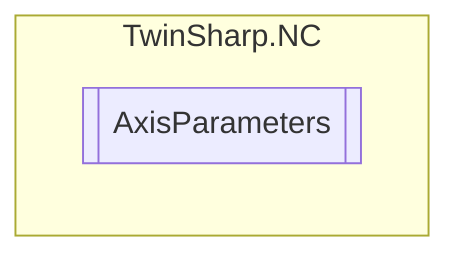

# AxisParameters `Public class`

## Diagram


## Members
### Properties
#### Public  properties
| Type | Name | Methods |
| --- | --- | --- |
| `double` | [`Acceleration`](#acceleration)<br>Default data set (e.g. mm/s^2) | `get, set` |
| `uint` | [`ChannelID`](#channelid) | `get` |
| `string` | [`ChannelName`](#channelname) | `get` |
| [`ChannelType`](./ChannelType.md) | [`ChannelType`](#channeltype) | `get` |
| `uint` | [`ControllerCount`](#controllercount) | `get` |
| `uint` | [`CycleTime`](#cycletime) | `get` |
| `double` | [`Deceleration`](#deceleration)<br>Default data set (e.g. mm/s^2) | `get, set` |
| `uint` | [`DriveCount`](#drivecount) | `get` |
| `uint` | [`EncoderCount`](#encodercount) | `get` |
| `uint``[]` | [`EncoderIDs`](#encoderids) | `get` |
| `double` | [`ErrorDelaySeconds`](#errordelayseconds) | `get, set` |
| [`ErrorReactionMode`](./ErrorReactionMode.md) | [`ErrorReactionMode`](#errorreactionmode) | `get, set` |
| `uint` | [`GroupID`](#groupid) | `get` |
| `string` | [`GroupName`](#groupname) | `get` |
| [`GroupType`](./GroupType.md) | [`GroupType`](#grouptype) | `get` |
| `uint` | [`ID`](#id) | `get` |
| `double` | [`Jerk`](#jerk)<br>Default data set (e.g. mm/s^3) | `get, set` |
| `bool` | [`LoopEnabled`](#loopenabled) | `get, set` |
| `double` | [`LoopingDistance`](#loopingdistance) | `get, set` |
| `double` | [`MaxPermittedAcceleration`](#maxpermittedacceleration) | `get, set` |
| `double` | [`MaxPermittedDeceleration`](#maxpermitteddeceleration) | `get, set` |
| `bool` | [`MotionMonitoringEnabled`](#motionmonitoringenabled) | `get, set` |
| `double` | [`MotionMonitoringSeconds`](#motionmonitoringseconds) | `get, set` |
| `string` | [`Name`](#name) | `get` |
| `string` | [`PhysicalUnit`](#physicalunit) | `get` |
| `bool` | [`PositionRangeMonitoringEnabled`](#positionrangemonitoringenabled) | `get, set` |
| `double` | [`PositionRangeMonitoringWindow`](#positionrangemonitoringwindow) | `get, set` |
| `double` | [`PulseWayNegativeDirection`](#pulsewaynegativedirection) | `get, set` |
| `double` | [`PulseWayPositiveDirection`](#pulsewaypositivedirection) | `get, set` |
| `double` | [`RefVelocityAtRefOutput`](#refvelocityatrefoutput)<br>Reference velocity at reference output (velocity pre-control) | `get, set` |
| `double` | [`RefVelocityCamDirection`](#refvelocitycamdirection) | `get, set` |
| `double` | [`RefVelocitySyncDirection`](#refvelocitysyncdirection) | `get, set` |
| `bool` | [`TargetPositionMonitoringEnabled`](#targetpositionmonitoringenabled) | `get, set` |
| `double` | [`TargetPositionMonitoringSeconds`](#targetpositionmonitoringseconds) | `get, set` |
| `double` | [`TargetPositionMonitoringWindow`](#targetpositionmonitoringwindow) | `get, set` |
| [`AxisType`](./AxisType.md) | [`Type`](#type) | `get` |
| `double` | [`VelocityHandFast`](#velocityhandfast) | `get, set` |
| `double` | [`VelocityHandSlow`](#velocityhandslow) | `get, set` |
| `double` | [`VelocityRapidTraverse`](#velocityrapidtraverse) | `get, set` |

### Methods
#### Internal  methods
| Returns | Name |
| --- | --- |
| `void` | [`ReadAllSubElements`](#readallsubelements)(out `uint``[]` encoderIDs, out `uint``[]` controllerIDs, out `uint``[]` driveIDs) |

## Details
### Constructors
#### AxisParameters
[*Source code*](https://github.com///blob//TwinSharp/NC/AxisParameters.cs#L11)
```csharp
internal AxisParameters(AdsClient client, uint id)
```
##### Arguments
| Type | Name | Description |
| --- | --- | --- |
| `AdsClient` | client |   |
| `uint` | id |   |

### Methods
#### ReadAllSubElements
[*Source code*](https://github.com///blob//TwinSharp/NC/AxisParameters.cs#L222)
```csharp
internal void ReadAllSubElements(out uint[] encoderIDs, out uint[] controllerIDs, out uint[] driveIDs)
```
##### Arguments
| Type | Name | Description |
| --- | --- | --- |
| `out` `uint``[]` | encoderIDs |   |
| `out` `uint``[]` | controllerIDs |   |
| `out` `uint``[]` | driveIDs |   |

### Properties
#### ID
```csharp
public uint ID { get; }
```

#### Name
```csharp
public string Name { get; }
```

#### Type
```csharp
public AxisType Type { get; }
```

#### CycleTime
```csharp
public uint CycleTime { get; }
```

#### PhysicalUnit
```csharp
public string PhysicalUnit { get; }
```

#### RefVelocityCamDirection
```csharp
public double RefVelocityCamDirection { get; set; }
```

#### RefVelocitySyncDirection
```csharp
public double RefVelocitySyncDirection { get; set; }
```

#### VelocityHandSlow
```csharp
public double VelocityHandSlow { get; set; }
```

#### VelocityHandFast
```csharp
public double VelocityHandFast { get; set; }
```

#### VelocityRapidTraverse
```csharp
public double VelocityRapidTraverse { get; set; }
```

#### PositionRangeMonitoringEnabled
```csharp
public bool PositionRangeMonitoringEnabled { get; set; }
```

#### PositionRangeMonitoringWindow
```csharp
public double PositionRangeMonitoringWindow { get; set; }
```

#### MotionMonitoringEnabled
```csharp
public bool MotionMonitoringEnabled { get; set; }
```

#### MotionMonitoringSeconds
```csharp
public double MotionMonitoringSeconds { get; set; }
```

#### LoopEnabled
```csharp
public bool LoopEnabled { get; set; }
```

#### LoopingDistance
```csharp
public double LoopingDistance { get; set; }
```

#### TargetPositionMonitoringEnabled
```csharp
public bool TargetPositionMonitoringEnabled { get; set; }
```

#### TargetPositionMonitoringWindow
```csharp
public double TargetPositionMonitoringWindow { get; set; }
```

#### TargetPositionMonitoringSeconds
```csharp
public double TargetPositionMonitoringSeconds { get; set; }
```

#### PulseWayPositiveDirection
```csharp
public double PulseWayPositiveDirection { get; set; }
```

#### PulseWayNegativeDirection
```csharp
public double PulseWayNegativeDirection { get; set; }
```

#### ErrorReactionMode
```csharp
public ErrorReactionMode ErrorReactionMode { get; set; }
```

#### ErrorDelaySeconds
```csharp
public double ErrorDelaySeconds { get; set; }
```

#### ChannelID
```csharp
public uint ChannelID { get; }
```

#### ChannelName
```csharp
public string ChannelName { get; }
```

#### ChannelType
```csharp
public ChannelType ChannelType { get; }
```

#### GroupID
```csharp
public uint GroupID { get; }
```

#### GroupName
```csharp
public string GroupName { get; }
```

#### GroupType
```csharp
public GroupType GroupType { get; }
```

#### EncoderCount
```csharp
public uint EncoderCount { get; }
```

#### EncoderIDs
```csharp
public uint EncoderIDs { get; }
```

#### ControllerCount
```csharp
public uint ControllerCount { get; }
```

#### DriveCount
```csharp
public uint DriveCount { get; }
```

#### MaxPermittedAcceleration
```csharp
public double MaxPermittedAcceleration { get; set; }
```

#### MaxPermittedDeceleration
```csharp
public double MaxPermittedDeceleration { get; set; }
```

#### Acceleration
```csharp
public double Acceleration { get; set; }
```
##### Summary
Default data set (e.g. mm/s^2)

#### Deceleration
```csharp
public double Deceleration { get; set; }
```
##### Summary
Default data set (e.g. mm/s^2)

#### Jerk
```csharp
public double Jerk { get; set; }
```
##### Summary
Default data set (e.g. mm/s^3)

#### RefVelocityAtRefOutput
```csharp
public double RefVelocityAtRefOutput { get; set; }
```
##### Summary
Reference velocity at reference output (velocity pre-control)

*Generated with* [*ModularDoc*](https://github.com/hailstorm75/ModularDoc)
