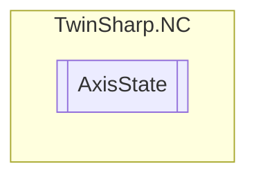

# AxisState `Public class`

## Diagram


## Members
### Properties
#### Public  properties
| Type | Name | Methods |
| --- | --- | --- |
| `double` | [`ActualAcceleration`](#actualacceleration) | `get` |
| `double` | [`ActualPosition`](#actualposition) | `get` |
| `double` | [`ActualPositionModulo`](#actualpositionmodulo) | `get` |
| `int` | [`ActualRotationModulo`](#actualrotationmodulo) | `get` |
| `double` | [`ActualVelocity`](#actualvelocity) | `get` |
| `uint` | [`CouplingState`](#couplingstate) | `get` |
| `uint` | [`CouplingTableIndex`](#couplingtableindex) | `get` |
| `uint` | [`CycleCounter`](#cyclecounter) | `get` |
| `uint` | [`DelayedErrorCode`](#delayederrorcode) | `get` |
| `uint` | [`ErrorCode`](#errorcode) | `get` |
| `double` | [`ExpectedTargetPosition`](#expectedtargetposition) | `get` |
| `uint` | [`InitializeCommandCounter`](#initializecommandcounter) | `get` |
| `double` | [`LagErrorPeakMaximum`](#lagerrorpeakmaximum) | `get` |
| `double` | [`LagErrorPeakMinimum`](#lagerrorpeakminimum) | `get` |
| `double` | [`LagErrorPosition`](#lagerrorposition) | `get` |
| `double` | [`LagErrorPositionWithDeadTimeCompensation`](#lagerrorpositionwithdeadtimecompensation) | `get` |
| [`NCAXISSTATE_ONLINESTRUCT`](./NCAXISSTATE_ONLINESTRUCT.md) | [`OnlineData`](#onlinedata) | `get` |
| `double` | [`PositioningTimeLastMotionCommand`](#positioningtimelastmotioncommand)<br>Positioning time of the last motion command<br>            (start → target position window) | `get` |
| `double` | [`RemainingTravelDistance`](#remainingtraveldistance) | `get` |
| `double` | [`RemaniningTravelTime`](#remaniningtraveltime) | `get` |
| `uint` | [`ResetCommandCounter`](#resetcommandcounter) | `get` |
| `double` | [`SetAcceleration`](#setacceleration) | `get` |
| `int` | [`SetCommandNumber`](#setcommandnumber) | `get` |
| `double` | [`SetCouplingFactor`](#setcouplingfactor) | `get` |
| `double` | [`SetJerk`](#setjerk) | `get` |
| `int` | [`SetModuloRotation`](#setmodulorotation) | `get` |
| `double` | [`SetPosition`](#setposition) | `get` |
| `double` | [`SetPositionModulo`](#setpositionmodulo) | `get` |
| `double` | [`SetTorque`](#settorque) | `get` |
| `double` | [`SetTorqueChange`](#settorquechange) | `get` |
| `double` | [`SetTravelDirection`](#settraveldirection) | `get` |
| `double` | [`SetVelocity`](#setvelocity) | `get` |
| `double` | [`SetVelocityOverride`](#setvelocityoverride) | `get` |
| `double` | [`TorqueOffset`](#torqueoffset) | `get, set` |
| `double` | [`UncorrectedSetAcceleration`](#uncorrectedsetacceleration) | `get` |
| `double` | [`UncorrectedSetPosition`](#uncorrectedsetposition) | `get` |
| `double` | [`UncorrectedSetTravelDirection`](#uncorrectedsettraveldirection) | `get` |
| `double` | [`UncorrectedSetVelocity`](#uncorrectedsetvelocity) | `get` |

## Details
### Constructors
#### AxisState
[*Source code*](https://github.com///blob//TwinSharp/NC/AxisState.cs#L12)
```csharp
internal AxisState(AdsClient client, uint id)
```
##### Arguments
| Type | Name | Description |
| --- | --- | --- |
| `AdsClient` | client |   |
| `uint` | id |   |

### Properties
#### OnlineData
```csharp
public NCAXISSTATE_ONLINESTRUCT OnlineData { get; }
```

#### ErrorCode
```csharp
public uint ErrorCode { get; }
```

#### CycleCounter
```csharp
public uint CycleCounter { get; }
```

#### SetPosition
```csharp
public double SetPosition { get; }
```

#### SetPositionModulo
```csharp
public double SetPositionModulo { get; }
```

#### SetModuloRotation
```csharp
public int SetModuloRotation { get; }
```

#### SetTravelDirection
```csharp
public double SetTravelDirection { get; }
```

#### SetVelocity
```csharp
public double SetVelocity { get; }
```

#### SetAcceleration
```csharp
public double SetAcceleration { get; }
```

#### SetJerk
```csharp
public double SetJerk { get; }
```

#### SetTorque
```csharp
public double SetTorque { get; }
```

#### SetCouplingFactor
```csharp
public double SetCouplingFactor { get; }
```

#### ExpectedTargetPosition
```csharp
public double ExpectedTargetPosition { get; }
```

#### RemainingTravelDistance
```csharp
public double RemainingTravelDistance { get; }
```

#### RemaniningTravelTime
```csharp
public double RemaniningTravelTime { get; }
```

#### SetCommandNumber
```csharp
public int SetCommandNumber { get; }
```

#### PositioningTimeLastMotionCommand
```csharp
public double PositioningTimeLastMotionCommand { get; }
```
##### Summary
Positioning time of the last motion command
            (start → target position window)

#### SetVelocityOverride
```csharp
public double SetVelocityOverride { get; }
```

#### UncorrectedSetPosition
```csharp
public double UncorrectedSetPosition { get; }
```

#### UncorrectedSetTravelDirection
```csharp
public double UncorrectedSetTravelDirection { get; }
```

#### UncorrectedSetVelocity
```csharp
public double UncorrectedSetVelocity { get; }
```

#### UncorrectedSetAcceleration
```csharp
public double UncorrectedSetAcceleration { get; }
```

#### CouplingState
```csharp
public uint CouplingState { get; }
```

#### CouplingTableIndex
```csharp
public uint CouplingTableIndex { get; }
```

#### DelayedErrorCode
```csharp
public uint DelayedErrorCode { get; }
```

#### InitializeCommandCounter
```csharp
public uint InitializeCommandCounter { get; }
```

#### ResetCommandCounter
```csharp
public uint ResetCommandCounter { get; }
```

#### SetTorqueChange
```csharp
public double SetTorqueChange { get; }
```

#### TorqueOffset
```csharp
public double TorqueOffset { get; set; }
```

#### ActualPosition
```csharp
public double ActualPosition { get; }
```

#### ActualPositionModulo
```csharp
public double ActualPositionModulo { get; }
```

#### ActualRotationModulo
```csharp
public int ActualRotationModulo { get; }
```

#### ActualVelocity
```csharp
public double ActualVelocity { get; }
```

#### ActualAcceleration
```csharp
public double ActualAcceleration { get; }
```

#### LagErrorPosition
```csharp
public double LagErrorPosition { get; }
```

#### LagErrorPositionWithDeadTimeCompensation
```csharp
public double LagErrorPositionWithDeadTimeCompensation { get; }
```

#### LagErrorPeakMaximum
```csharp
public double LagErrorPeakMaximum { get; }
```

#### LagErrorPeakMinimum
```csharp
public double LagErrorPeakMinimum { get; }
```

*Generated with* [*ModularDoc*](https://github.com/hailstorm75/ModularDoc)
