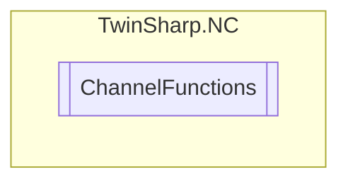

# ChannelFunctions `Public class`

## Diagram


## Members
### Methods
#### Public  methods
| Returns | Name |
| --- | --- |
| `void` | [`LoadProgramByName`](#loadprogrambyname)(`string` programName) |
| `void` | [`LoadProgramByNumber`](#loadprogrambynumber)(`uint` programNumber) |
| `void` | [`ResetChannel`](#resetchannel)() |
| `void` | [`RetryChannel`](#retrychannel)() |
| `void` | [`SetInterpreterOperationMode`](#setinterpreteroperationmode)([`InterpreterOperationMode`](./InterpreterOperationMode.md) mode) |
| `void` | [`SetPathForSubRoutines`](#setpathforsubroutines)(`string` path) |
| `void` | [`SkipChannel`](#skipchannel)() |
| `void` | [`StartInterpreter`](#startinterpreter)() |
| `void` | [`StopChannel`](#stopchannel)() |

## Details
### Constructors
#### ChannelFunctions
[*Source code*](https://github.com///blob//TwinSharp/NC/ChannelFunctions.cs#L10)
```csharp
internal ChannelFunctions(AdsClient client, uint id)
```
##### Arguments
| Type | Name | Description |
| --- | --- | --- |
| `AdsClient` | client |   |
| `uint` | id |   |

### Methods
#### LoadProgramByNumber
[*Source code*](https://github.com///blob//TwinSharp/NC/ChannelFunctions.cs#L17)
```csharp
public void LoadProgramByNumber(uint programNumber)
```
##### Arguments
| Type | Name | Description |
| --- | --- | --- |
| `uint` | programNumber |   |

#### StartInterpreter
[*Source code*](https://github.com///blob//TwinSharp/NC/ChannelFunctions.cs#L22)
```csharp
public void StartInterpreter()
```

#### LoadProgramByName
[*Source code*](https://github.com///blob//TwinSharp/NC/ChannelFunctions.cs#L27)
```csharp
public void LoadProgramByName(string programName)
```
##### Arguments
| Type | Name | Description |
| --- | --- | --- |
| `string` | programName |   |

#### SetInterpreterOperationMode
[*Source code*](https://github.com///blob//TwinSharp/NC/ChannelFunctions.cs#L32)
```csharp
public void SetInterpreterOperationMode(InterpreterOperationMode mode)
```
##### Arguments
| Type | Name | Description |
| --- | --- | --- |
| [`InterpreterOperationMode`](./InterpreterOperationMode.md) | mode |   |

#### SetPathForSubRoutines
[*Source code*](https://github.com///blob//TwinSharp/NC/ChannelFunctions.cs#L37)
```csharp
public void SetPathForSubRoutines(string path)
```
##### Arguments
| Type | Name | Description |
| --- | --- | --- |
| `string` | path |   |

#### ResetChannel
[*Source code*](https://github.com///blob//TwinSharp/NC/ChannelFunctions.cs#L42)
```csharp
public void ResetChannel()
```

#### StopChannel
[*Source code*](https://github.com///blob//TwinSharp/NC/ChannelFunctions.cs#L47)
```csharp
public void StopChannel()
```

#### RetryChannel
[*Source code*](https://github.com///blob//TwinSharp/NC/ChannelFunctions.cs#L52)
```csharp
public void RetryChannel()
```

#### SkipChannel
[*Source code*](https://github.com///blob//TwinSharp/NC/ChannelFunctions.cs#L57)
```csharp
public void SkipChannel()
```

*Generated with* [*ModularDoc*](https://github.com/hailstorm75/ModularDoc)
