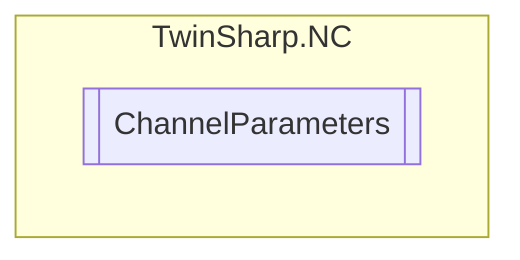

# ChannelParameters `Public class`

## Diagram


## Members
### Properties
#### Public  properties
| Type | Name | Methods |
| --- | --- | --- |
| `ushort` | [`ActivationOfDefaultGcode`](#activationofdefaultgcode) | `get, set` |
| `double` | [`G70Factor`](#g70factor) | `get, set` |
| `double` | [`G71Factor`](#g71factor) | `get, set` |
| `uint` | [`GroupId`](#groupid)<br>Group ID (only explicit for 3D and FIFO channel) | `get` |
| `uint` | [`ID`](#id) | `get` |
| [`InterpolationLoadLogMode`](./InterpolationLoadLogMode.md) | [`InterpolationLoadLogMode`](#interpolationloadlogmode) | `get, set` |
| [`InterpolationTraceMode`](./InterpolationTraceMode.md) | [`InterpolationTraceMode`](#interpolationtracemode) | `get, set` |
| [`InterpreterType`](./InterpreterType.md) | [`InterpreterType`](#interpretertype) | `get` |
| `string` | [`Name`](#name) | `get` |
| `uint` | [`NcLoggerLevel`](#ncloggerlevel)<br>Channel specific level for NC logger messages 0: errors only 1: all NC messages | `get, set` |
| `uint` | [`ProgramLoadBufferSize`](#programloadbuffersize) | `get` |
| `uint` | [`ProgramNumberJobList`](#programnumberjoblist) | `get` |
| `uint` | [`RecordAllFeederEntries`](#recordallfeederentries)<br>Records all feeder entries in a log file named "TcNci.log" | `get, set` |
| [`ChannelType`](./ChannelType.md) | [`Type`](#type) | `get` |

## Details
### Constructors
#### ChannelParameters
[*Source code*](https://github.com///blob//TwinSharp/NC/ChannelParameters.cs#L11)
```csharp
internal ChannelParameters(AdsClient client, uint id)
```
##### Arguments
| Type | Name | Description |
| --- | --- | --- |
| `AdsClient` | client |   |
| `uint` | id |   |

### Properties
#### ID
```csharp
public uint ID { get; }
```

#### Name
```csharp
public string Name { get; }
```

#### Type
```csharp
public ChannelType Type { get; }
```

#### InterpreterType
```csharp
public InterpreterType InterpreterType { get; }
```

#### ProgramLoadBufferSize
```csharp
public uint ProgramLoadBufferSize { get; }
```

#### ProgramNumberJobList
```csharp
public uint ProgramNumberJobList { get; }
```

#### InterpolationLoadLogMode
```csharp
public InterpolationLoadLogMode InterpolationLoadLogMode { get; set; }
```

#### InterpolationTraceMode
```csharp
public InterpolationTraceMode InterpolationTraceMode { get; set; }
```

#### RecordAllFeederEntries
```csharp
public uint RecordAllFeederEntries { get; set; }
```
##### Summary
Records all feeder entries in a log file named "TcNci.log"

#### NcLoggerLevel
```csharp
public uint NcLoggerLevel { get; set; }
```
##### Summary
Channel specific level for NC logger messages 0: errors only 1: all NC messages

#### G70Factor
```csharp
public double G70Factor { get; set; }
```

#### G71Factor
```csharp
public double G71Factor { get; set; }
```

#### ActivationOfDefaultGcode
```csharp
public ushort ActivationOfDefaultGcode { get; set; }
```

#### GroupId
```csharp
public uint GroupId { get; }
```
##### Summary
Group ID (only explicit for 3D and FIFO channel)

*Generated with* [*ModularDoc*](https://github.com/hailstorm75/ModularDoc)
