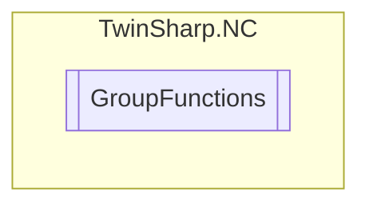

# GroupFunctions `Public class`

## Diagram


## Members
### Methods
#### Public  methods
| Returns | Name |
| --- | --- |
| `void` | [`Clear`](#clear)()<br>Clear group (buffer/task) |
| `void` | [`EmergencyStop`](#emergencystop)(`double` deceleration, `double` jerk)<br>Emergency stop(E-stop) (emergency stop with controlled ramp) |
| `void` | [`FifoOverwrite`](#fifooverwrite)(`double``[]` entries)<br>Overwrite the last x FIFO entries (lines): (x*m)-values (one or more lines) n: FIFO length (number of lines) m: FIFO dimension (number of columns) range of values x: [1 ... n] |
| `void` | [`FifoStart`](#fifostart)()<br>Start FIFO group(FIFO table must have been filled in advance) |
| `void` | [`FifoWrite`](#fifowrite)(`double``[]` entries)<br>Write x FIFO entries (lines): (x*m)-values (one or more lines) n: FIFO length (number of lines) m: FIFO dimension (number of columns) range of values x: [1 ... n] |
| `void` | [`Reset`](#reset)()<br>Reset group |
| `void` | [`Stop`](#stop)()<br>Stop group |

## Details
### Constructors
#### GroupFunctions
[*Source code*](https://github.com///blob//TwinSharp/NC/GroupFunctions.cs#L10)
```csharp
public GroupFunctions(AdsClient client, uint id)
```
##### Arguments
| Type | Name | Description |
| --- | --- | --- |
| `AdsClient` | client |   |
| `uint` | id |   |

### Methods
#### Reset
[*Source code*](https://github.com///blob//TwinSharp/NC/GroupFunctions.cs#L20)
```csharp
public void Reset()
```
##### Summary
Reset group

#### Stop
[*Source code*](https://github.com///blob//TwinSharp/NC/GroupFunctions.cs#L28)
```csharp
public void Stop()
```
##### Summary
Stop group

#### Clear
[*Source code*](https://github.com///blob//TwinSharp/NC/GroupFunctions.cs#L36)
```csharp
public void Clear()
```
##### Summary
Clear group (buffer/task)

#### EmergencyStop
[*Source code*](https://github.com///blob//TwinSharp/NC/GroupFunctions.cs#L46)
```csharp
public void EmergencyStop(double deceleration, double jerk)
```
##### Arguments
| Type | Name | Description |
| --- | --- | --- |
| `double` | deceleration | Deceleration (must be greater than or equal to the original deceleration) |
| `double` | jerk | Jerk (must greater than or equal to the original jerk) |

##### Summary
Emergency stop(E-stop) (emergency stop with controlled ramp)

#### FifoStart
[*Source code*](https://github.com///blob//TwinSharp/NC/GroupFunctions.cs#L59)
```csharp
public void FifoStart()
```
##### Summary
Start FIFO group(FIFO table must have been filled in advance)

#### FifoWrite
[*Source code*](https://github.com///blob//TwinSharp/NC/GroupFunctions.cs#L68)
```csharp
public void FifoWrite(double[] entries)
```
##### Arguments
| Type | Name | Description |
| --- | --- | --- |
| `double``[]` | entries |  |

##### Summary
Write x FIFO entries (lines): (x*m)-values (one or more lines) n: FIFO length (number of lines) m: FIFO dimension (number of columns) range of values x: [1 ... n]

#### FifoOverwrite
[*Source code*](https://github.com///blob//TwinSharp/NC/GroupFunctions.cs#L77)
```csharp
public void FifoOverwrite(double[] entries)
```
##### Arguments
| Type | Name | Description |
| --- | --- | --- |
| `double``[]` | entries |  |

##### Summary
Overwrite the last x FIFO entries (lines): (x*m)-values (one or more lines) n: FIFO length (number of lines) m: FIFO dimension (number of columns) range of values x: [1 ... n]

*Generated with* [*ModularDoc*](https://github.com/hailstorm75/ModularDoc)
