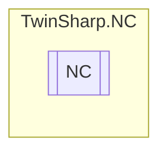

# NC `Public class`

## Description
The NC class provides access to the NC (Numerical Control) system using TwinCAT ADS protocol.
            It initializes and manages the Ring0Manager, Axes, Channels, Groups and Tables components.

## Diagram


## Details
### Summary
The NC class provides access to the NC (Numerical Control) system using TwinCAT ADS protocol.
            It initializes and manages the Ring0Manager, Axes, Channels, Groups and Tables components.

### Constructors
#### NC [1/2]
[*Source code*](https://github.com///blob//TwinSharp/NC/NC.cs#L18)
```csharp
public NC(AmsNetId target)
```
##### Arguments
| Type | Name | Description |
| --- | --- | --- |
| `AmsNetId` | target |   |

#### NC [2/2]
[*Source code*](https://github.com///blob//TwinSharp/NC/NC.cs#L23)
```csharp
public NC()
```

*Generated with* [*ModularDoc*](https://github.com/hailstorm75/ModularDoc)
