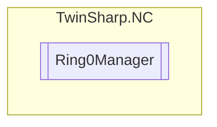

# Ring0Manager `Public class`

## Diagram


## Details
### Constructors
#### Ring0Manager
[*Source code*](https://github.com///blob//TwinSharp/NC/Ring0Manager.cs#L10)
```csharp
public Ring0Manager(AmsNetId target)
```
##### Arguments
| Type | Name | Description |
| --- | --- | --- |
| `AmsNetId` | target |   |

*Generated with* [*ModularDoc*](https://github.com/hailstorm75/ModularDoc)
