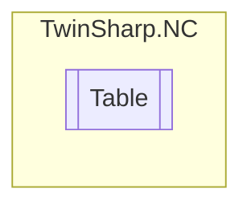

# Table `Public class`

## Description
The `Table` class encapsulates various functionalities, parameters, and states related to a table in the context of TwinCAT ADS.
            It provides a structured way to interact with tables, which are likely used for motion control or other automation tasks.

## Diagram


## Details
### Summary
The `Table` class encapsulates various functionalities, parameters, and states related to a table in the context of TwinCAT ADS.
            It provides a structured way to interact with tables, which are likely used for motion control or other automation tasks.

### Constructors
#### Table
[*Source code*](https://github.com///blob//TwinSharp/NC/Table.cs#L15)
```csharp
internal Table(AdsClient client, uint id)
```
##### Arguments
| Type | Name | Description |
| --- | --- | --- |
| `AdsClient` | client |   |
| `uint` | id |   |

*Generated with* [*ModularDoc*](https://github.com/hailstorm75/ModularDoc)
