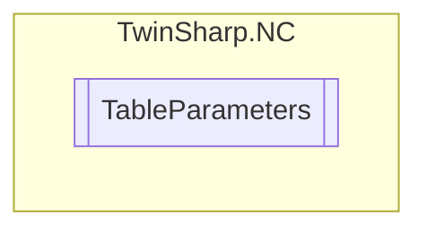

# TableParameters `Public class`

## Diagram


## Members
### Properties
#### Public  properties
| Type | Name | Methods |
| --- | --- | --- |
| `uint` | [`ColumnCount`](#columncount) | `get` |
| `uint` | [`ID`](#id) | `get` |
| `uint` | [`LineCount`](#linecount) | `get` |
| [`TableMainType`](./TableMainType.md) | [`MainType`](#maintype) | `get` |
| `double` | [`MasterPeriod`](#masterperiod)<br>Master period (cyclic table).<br>            Base unit (e.g. degree) | `get` |
| `string` | [`Name`](#name) | `get` |
| `double` | [`SlaveDifferencePerMasterPeriod`](#slavedifferencepermasterperiod)<br>Slave difference per master period (cyclic table).<br>            Base unit (e.g. degree) | `get` |
| `double` | [`SlavePositionToMaster`](#slavepositiontomaster)<br>Read slave position to the given master position (relates only to the "row values" of the table) | `get, set` |
| `double` | [`StepWidth`](#stepwidth)<br>Step width (position delta) (equidistant table )<br>            Equidistant Tables<br>            Base unit (e.g. mm) | `get` |
| [`TableSubType`](./TableSubType.md) | [`SubTupe`](#subtupe) | `get` |
| `uint` | [`TotalCount`](#totalcount) | `get` |

### Methods
#### Public  methods
| Returns | Name |
| --- | --- |
| `void` | [`GetActivationMode`](#getactivationmode)(out [`TableActivationMode`](./TableActivationMode.md) activationMode, out `double` activationPosition, out [`MasterScalingType`](./MasterScalingType.md) masterScalingType, out [`SlaveScalingType`](./SlaveScalingType.md) slaveScalingType) |
| `double` | [`GetSingleValue`](#getsinglevalue)(`uint` line, `uint` column) |
| `void` | [`SetActivationMode`](#setactivationmode)([`TableActivationMode`](./TableActivationMode.md) activationMode, `double` activationPosition, [`MasterScalingType`](./MasterScalingType.md) masterScalingType, [`SlaveScalingType`](./SlaveScalingType.md) slaveScalingType)<br>Set Activation mode for online change from table data (only MF). |
| `void` | [`SetSingleValue`](#setsinglevalue)(`uint` line, `uint` column, `double` value)<br>Write single value [n,m]. |

## Details
### Constructors
#### TableParameters
[*Source code*](https://github.com///blob//TwinSharp/NC/TableParameters.cs#L11)
```csharp
internal TableParameters(AdsClient client, uint id)
```
##### Arguments
| Type | Name | Description |
| --- | --- | --- |
| `AdsClient` | client |   |
| `uint` | id |   |

### Methods
#### GetActivationMode
[*Source code*](https://github.com///blob//TwinSharp/NC/TableParameters.cs#L88)
```csharp
public void GetActivationMode(out TableActivationMode activationMode, out double activationPosition, out MasterScalingType masterScalingType, out SlaveScalingType slaveScalingType)
```
##### Arguments
| Type | Name | Description |
| --- | --- | --- |
| `out` [`TableActivationMode`](./TableActivationMode.md) | activationMode |   |
| `out` `double` | activationPosition |   |
| `out` [`MasterScalingType`](./MasterScalingType.md) | masterScalingType |   |
| `out` [`SlaveScalingType`](./SlaveScalingType.md) | slaveScalingType |   |

#### SetActivationMode
[*Source code*](https://github.com///blob//TwinSharp/NC/TableParameters.cs#L110)
```csharp
public void SetActivationMode(TableActivationMode activationMode, double activationPosition, MasterScalingType masterScalingType, SlaveScalingType slaveScalingType)
```
##### Arguments
| Type | Name | Description |
| --- | --- | --- |
| [`TableActivationMode`](./TableActivationMode.md) | activationMode | Activation mode: 0: 'instantaneous' (default) 1: 'master cam pos.' 2: 'master' axis pos.' 3: 'next cycle' 4: 'next cycle once' 5: 'as soon as possible' 6: 'off' 7: 'delete queued data' |
| `double` | activationPosition | Activation position (e.g. mm) |
| [`MasterScalingType`](./MasterScalingType.md) | masterScalingType | Master scaling type 0: user defined (default) 1: scaling with auto offset 2: off |
| [`SlaveScalingType`](./SlaveScalingType.md) | slaveScalingType | Slave scaling type 0: user defined (default) 1: scaling with auto offset 2: off |

##### Summary
Set Activation mode for online change from table data (only MF).

#### GetSingleValue
[*Source code*](https://github.com///blob//TwinSharp/NC/TableParameters.cs#L123)
```csharp
public double GetSingleValue(uint line, uint column)
```
##### Arguments
| Type | Name | Description |
| --- | --- | --- |
| `uint` | line |   |
| `uint` | column |   |

#### SetSingleValue
[*Source code*](https://github.com///blob//TwinSharp/NC/TableParameters.cs#L151)
```csharp
public void SetSingleValue(uint line, uint column, double value)
```
##### Arguments
| Type | Name | Description |
| --- | --- | --- |
| `uint` | line | n-th line |
| `uint` | column | m-th column |
| `double` | value | Single value. Base unit (e.g. mm) |

##### Summary
Write single value [n,m].

### Properties
#### ID
```csharp
public uint ID { get; }
```

#### Name
```csharp
public string Name { get; }
```

#### SubTupe
```csharp
public TableSubType SubTupe { get; }
```

#### MainType
```csharp
public TableMainType MainType { get; }
```

#### LineCount
```csharp
public uint LineCount { get; }
```

#### ColumnCount
```csharp
public uint ColumnCount { get; }
```

#### TotalCount
```csharp
public uint TotalCount { get; }
```

#### StepWidth
```csharp
public double StepWidth { get; }
```
##### Summary
Step width (position delta) (equidistant table )
            Equidistant Tables
            Base unit (e.g. mm)

#### MasterPeriod
```csharp
public double MasterPeriod { get; }
```
##### Summary
Master period (cyclic table).
            Base unit (e.g. degree)

#### SlaveDifferencePerMasterPeriod
```csharp
public double SlaveDifferencePerMasterPeriod { get; }
```
##### Summary
Slave difference per master period (cyclic table).
            Base unit (e.g. degree)

#### SlavePositionToMaster
```csharp
public double SlavePositionToMaster { get; set; }
```
##### Summary
Read slave position to the given master position (relates only to the "row values" of the table)

*Generated with* [*ModularDoc*](https://github.com/hailstorm75/ModularDoc)
