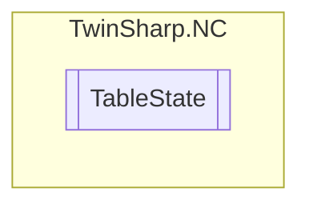

# TableState `Public class`

## Diagram


## Members
### Properties
#### Public  properties
| Type | Name | Methods |
| --- | --- | --- |
| `int` | [`UserCounter`](#usercounter)<br>'User Counter' (number of table user) | `get` |

## Details
### Constructors
#### TableState
[*Source code*](https://github.com///blob//TwinSharp/NC/TableState.cs#L10)
```csharp
internal TableState(AdsClient client, uint id)
```
##### Arguments
| Type | Name | Description |
| --- | --- | --- |
| `AdsClient` | client |   |
| `uint` | id |   |

### Properties
#### UserCounter
```csharp
public int UserCounter { get; }
```
##### Summary
'User Counter' (number of table user)

*Generated with* [*ModularDoc*](https://github.com/hailstorm75/ModularDoc)
